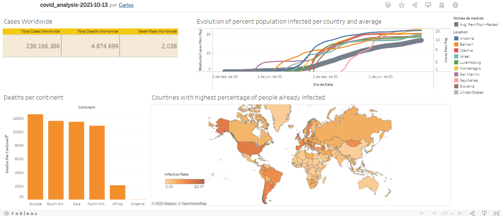

# A Covid-19 data analysis

This repository contains a data analysis project on covid-19 with data updated until 2021-10-13.

The main analysis is done with SQL, and uses a dataset downloaded from [here](https://ourworldindata.org/covid-deaths).

A Tableau Visualization can be found in here (https://public.tableau.com/app/profile/carlos6708/viz/covid_analysis-2021-10-13/Dashboard1?publish=yes).
This project was inspired in a [series of videos](https://www.youtube.com/watch?v=qfyynHBFOsM&list=PLUaB-1hjhk8H48Pj32z4GZgGWyylqv85f) from the youtube channel "Alex - The Analyst".

